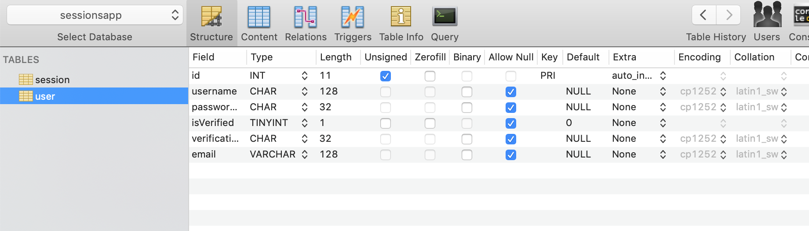
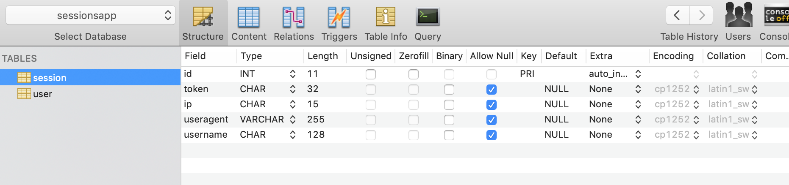

This is a vanilla node server app that uses mysql as the database. It demonstrates how to register and verify users, log in, and log out. 

I'm a beginner so this project likely doesn't demonstrate best practices.

This app is for demonstration/learning purposes. It's not complete. It will work to create users and log them in and out.

## What is the app missing?
- There's nothing stopping you from registering different usernames under the same email. 
- A UI for resending the verification code
- An endpoint that deletes or updates accounts
- Some errors don't catch properly
- Some promises should throw an error but they don't
- Validations
- Some of the code could be more DRY

All of them are easy fixes. Obviously this isn't a very useful app because it does nothing but create users. But this is for demonstration purposes for myself and anyone else who wants to see how you can make a vanilla node.js app with logins.

## Instructions
**Make sure to replace '127.0.0.1:3000'** on line 62 of `api.js` with your project domain or wherever you're hosting the app.

## How To Set Up Your Database:

### User Table

### Session Table

